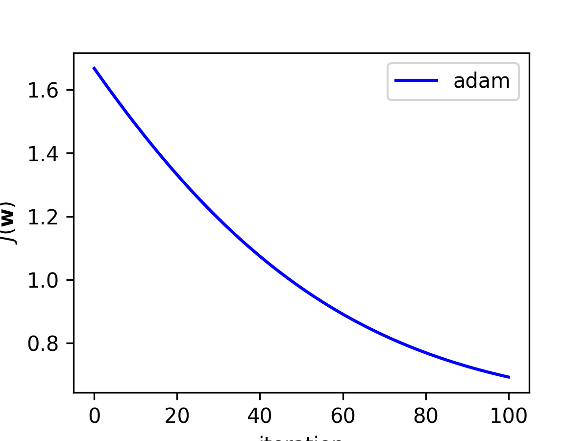
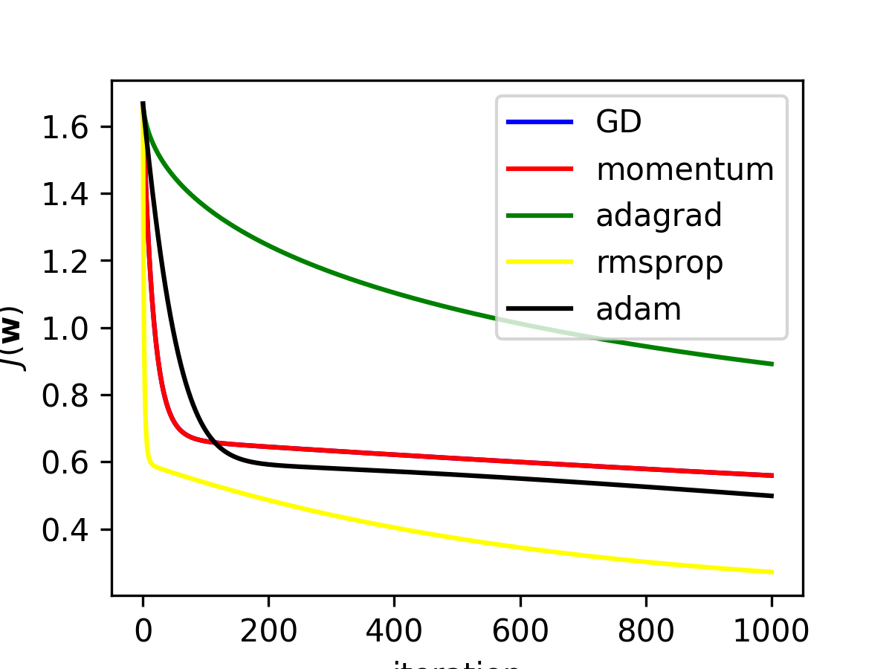

# Problem understanding:#
Here description of the problem. </br>


<!-- <br> -->
Refer to this [link](https://www.kaggle.com/competitions/dogs-vs-cats/data) to get the data.

# Run the project #
Here description of the project.

If you do not have venv package, please refer to this [link](https://linuxize.com/post/how-to-create-python-virtual-environments-on-ubuntu-18-04/)
</br>

## Create virtual environment ##

```
$ python3 -m venv ENV_NAME
```
## Activate your environment ##

```
$ source ENV_NAME/bin/activate
```

## Requirement installations ##
To run this, make sure to install all the requirements by:

```
$ pip install -r requirements.txt 
```
# Training the model with a specific optimizer #

```
$ python3 main.py --optimizer --max_iter
```
## Example of running models ##

```
$ python3 main.py --optimizer adam --max_iter 1000
```

```
$ python3 main.py --optimizer all --max_iter 1000
```

# Results Presentation

``` adam result```  </br>
 

``` all result```  </br>
 
---
___

---
___

# Related Papers #

* <a href= 'https://arxiv.org/pdf/1412.6980.pdf'> Adam </a>
* <a href= 'https://arxiv.org/pdf/1212.5701.pdf'> Adadelta</a>
* <a href= 'https://arxiv.org/pdf/1212.5701.pdf'> Momentum</a>
* <a href= 'https://arxiv.org/pdf/1212.5701.pdf'> RMSProp</a>
* <a href= 'https://arxiv.org/pdf/1212.5701.pdf'> Adagrad</a>


# Contributors #
<div style="display:flex;align-items:center">

<div style="display:flex;align-items:center">
  <div>
    <h5> <a href='.'> Mm. Khadija Iddrisu </a> </h5> 
   
  <div>
        <h5> <a href='..'> Mr. Paul sanyang</a> </h5> 
  <div>
    <h5> <a href='.'> Mr. Albert Agisha N </a> </h5> 
    
  <div>
    <h5> <a href='.'> Mr. Idriss Nguepi N  </a> </h5> 
    
</div>